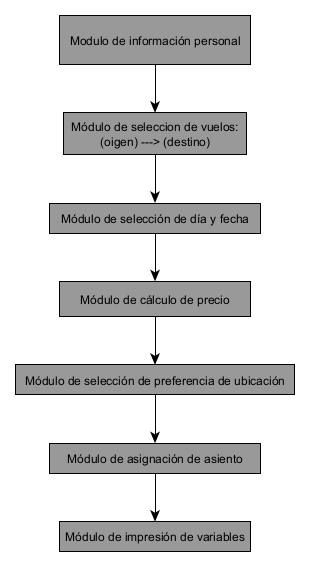

# Analisis del problema
## Variables de entrada:
Las variables de entrada que yo definí fueron:
- **título**: Variable de cadena de caracteres, en la que el usuario ingresa si es sr o sra.
- **Nombre**: Variable de cadena de caracteres, Primer nombre de usuario.
- **Apellido**: Variable de cadena de caracteres, Primer apellido del usuario. Estas 2 ultimas también la consideraría variables de salida, ya que son las imprimidas en el mensaje de bienvenida.
- **origen**: Esta variable la decidí poner como un input, dado que defino las distancias y las ciudades en una sola lista; el problema de esto es que si el usuario ingresa un valor diferente a los listados, el programa da un error. Esto se puede solucionar de muchas formas.
- **destino**: También es un input, misma situación que la anterior.
- **preferencia**: Esta es una variable que utilicé para definir el numero de asiento a posteriori con una columna de "if" o "si"

Luego **día_viaje** lo definí como una lista para: con dos columnas de "si" puedo "preguntar" si el intervalo va de lunes a juves para que me de un resultado, o si va de viernes a domingo para que me de otro, esto dependiendo de la distancia de recorrido.

Así mismo definí las ciudades dentro de la lista **distancias** para hacer directamente las combinaciones que me dan las distancias, esto para calcular los precios respecto a los **dias_viaje** en la columna de "si" mencionada anteriormente.

## Variables de salida
Las variables de salida que yo elegí luego de definir las de entrada son las siguientes:
- **dia_mes**, **mes**: Si bien el usuario las ingresa, no son de mucha utilidad ya que no corresponden con el **día_viaje** al no estar ordenadas en forma de calendario (matríz), sin embargo se muestran en el print del final. Por esta razón decidí colocarlas como *output* o *variables de salida*.
- **distancia**: Variable que surge de los pares de ciudades de la lista **distancias**
- **precio**: Variable que surge en el bloque de "si" encargado de calcular los precios respecto a la **distancia** y a la lista **dia_viaje**.
- **tipo_asiento**: Variable que surge del bloque de "si" destinado a la asignacion de la letra de asiento respecto a la variable **preferencia**
- **numero_asiento**: Simplemente genera un numero aleatorio del 1 al 29, para luego mostrarse en el bloque final de impresión junto a la variable **tipo_asiento**

# Funcionamiento de los bloques
