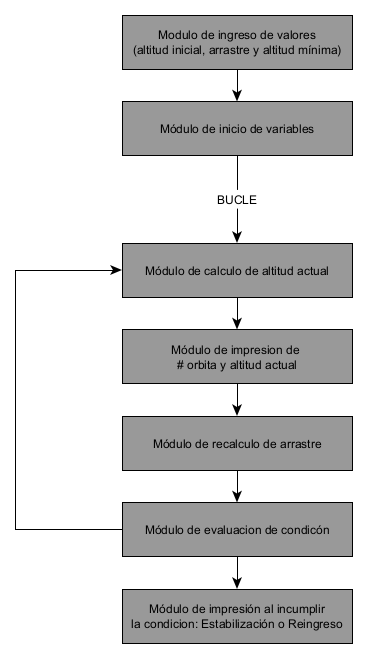

# Analisis del problema
## Variables de entrada (y salida también)
- **altitud_inicial**: Variable entera, variable requerida para la inicializacion de variables.
- **arrastre**: Variable de punto flotante, numero pequeño requerido para el calculo de la **altitud_perdida**, por cada **orbitas_completadas** este valor aumenta un numero definido por nosotros.
- **altitud_mínima**: Variable entera, variable requerida para romper el mientras con un bloque "si"
- **altitud_estabilización**: Variable punto flotante, en este caso no lo tenía muy claro, dado que por la naturaleza de las operaciones requeridas es prácticamente imposible que el satélite se estabilize (me refiero a algo parecido a una función logarimica reflejada en x), y este valor siempre cambiaría cada vez que ingresamos parametros distintos, por lo que suponiendo que el usuario tenga una idea de más o menos como será la simulacion puede elegir un valor tal que la **altitud_perdida** al acercarse o ser < que esta se pueda decir "el satelite se estabilizó. Esta variable no es de salida.
## Variables de salida
- **orbitas_completas**: esta variable surge de la inicializacion **orbitas_completas**=0, por cada cicilo necesito añadir una orbita completada a esta variable.

# Funcionamiento de los bloques:
